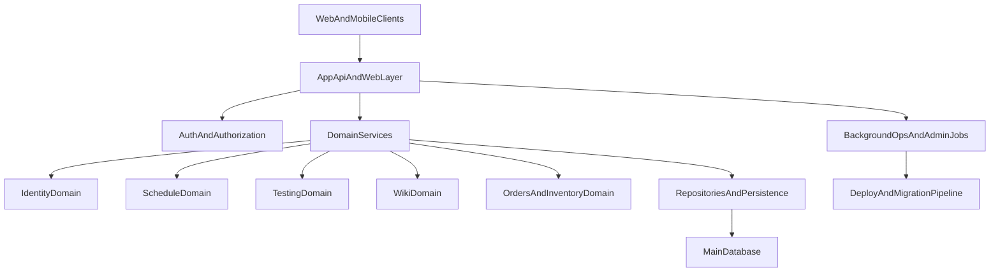

# New Project Baseline and Roadmap (Draft)

## Reuse vs Rewrite Matrix

### Keep as-is (small hardening only)
- Wiki domain core
  - `app/Http/Controllers/WikiController.php`
  - `app/Models/WikiPage.php`
- Password manager core
  - `app/Http/Controllers/PasswordManagerController.php`

### Refactor and keep
- Permission mapping concept and middleware
  - `app/Support/PageAccess.php`
  - `app/Http/Middleware/EnsurePageAccess.php`
- Testing and schedule domains
  - `app/Http/Controllers/StudentTestingController.php`
  - `app/Http/Controllers/GroupScheduleController.php`
  - `app/Http/Controllers/ScheduleConstructorSettingsController.php`
- Mobile API surface (with new auth model)
  - `app/Http/Controllers/MobileApiController.php`
- Inventory domain (split into smaller services)
  - `app/Http/Controllers/InventoryController.php`

### Rewrite
- Web authentication flow
  - `app/Http/Controllers/AuthController.php`
- Settings + deploy/db-profile orchestration in HTTP
  - `app/Http/Controllers/SettingsController.php`
  - `app/Support/DatabaseProfileManager.php`
- Orders legacy workflow
  - `app/Http/Controllers/OrdersController.php`

## Target Architecture (high level)

## Migration Waves

## Wave 1: Foundation and risk reduction
- Build new auth/session model and permission contracts.
- Remove deploy/migrate execution from web endpoints.
- Add mandatory request validation and policy checks on all write paths.

## Wave 2: Stable domain migration
- Move wiki + schedule + testing to service-first modules.
- Normalize APIs between web and mobile.
- Add focused tests for permission boundaries and critical workflows.

## Wave 3: Legacy replacement
- Rewrite orders flow with explicit state transitions.
- Refactor inventory into bounded components.
- Complete DB integrity hardening (FKs, uniques, constraints).

## Wave 4: Operational maturity
- CI artifact-based releases and controlled migrations.
- Backup gate and rollback playbook automation.
- Observability baseline: structured logs + alerts + health checks.

## Initial Backlog for New Project Kickoff
1. Define domain boundaries and module ownership.
2. Design auth model (web + mobile) and permission enforcement strategy.
3. Approve data migration policy (ID preservation, dedupe, FK enforcement order).
4. Define deployment model (git clone pipeline vs artifact deploy only).
5. Freeze non-critical legacy feature changes during extraction period.

